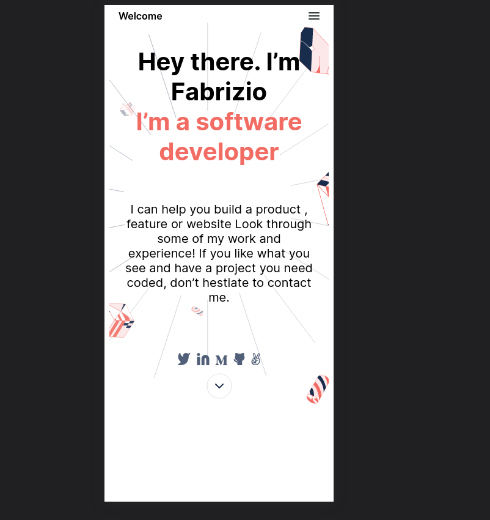

# Portfolio Webpage

> My personal portfolio webpage (under development).



Webpage I use to show my work and selling my services. The webpage until now is a very basic combination of both HTML and CSS but it will continue to improve over time .


## Live Demo!!
[My Website Link](https://katiscoding.github.io/Portfolio/)

## Built With

- HTML&CSS

## Getting Started

**How to use.**

To get a local copy up and running follow these simple example steps.

### Prerequisites
Web browser (Google Chrome, Firefox, Safari)
### Setup
git clone https://github.com/KatIsCoding/Portfolio
### Usage
Open the file "index.html" with your browser
### Run tests
cd into the cloned folder and run 
```bash
npx hint .
```
 and 
 ```bash
npx stylelint "**/*.{css,scss}"
```
## Authors

👤 **Fabrizio**

- GitHub: [@KatIsCoding](https://github.com/KatIsCoding)
- Twitter: [@fabrizio](https://twitter.com/fabriziogr211)
- LinkedIn: [Fabrizio](https://www.linkedin.com/in/fabrizio-gomez-6a00801a3/)

## Latest Issue

> The following links to the latest issue inside the project.
[LatestIssue](https://github.com/KatIsCoding/Portfolio/pull/7)

## Show your support

Give a ⭐️ if you like this project!
